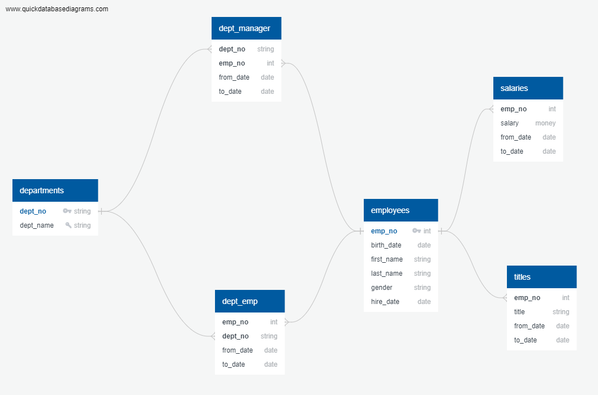

# sql-challenge
Creation of a sql database organizing departments and employees.
## [Data](data)
Directory housing the csv files holding data used to create the database.
Data lists:
* [Departments](data/departments.csv)
* [Employees](data/employees.csv)
* [Department Employees](data/dept_emp.csv)
* [Department Managers](data/dept_manager.csv)
* [Salaries](data/salaries.csv)
* [Titles](data/titles.csv)
## [ERD](ERD)
Directory housing the database's ERD and ERD code.
### [Diagram](ERD/ERDdiagram.png)

ERD for the database created. Shows organizational structure of database's tables, their keys, and their relations.
### [Code](ERD/erdCode.txt)
Code for creating the ERD using [QuickDB](https://app.quickdatabasediagrams.com/).
## [SQL](SQL)
Directory housing SQL database schema and query code.
### [Schema](SQL/schema.sql)
Code for creation of the database's tables
### [Query](SQL/query.sql)
Code for querying the database.
## [Charting the Data](dataset_test.ipynb)
Jupyter Notebook creating [charts](charts) from the data in the created SQL database.
## [Charts](charts)
Charts made from the [salary](data/salaries.csv) and [title](data/titles.csv) data in the database.
### [Salary Frequency](charts/salaryFrequency.png)
 
Histogram plotting the number of employees in different salary ranges. Ranges are determined as increments of $10,000 from the minimum salary to the maximum salary.
### [Average Salary Per Title](charts/salaryByTitle.png)
 
Bar chart plotting the average salary for every title in the company.
## Built With
* [QuickDB](https://app.quickdatabasediagrams.com/)
* [PostgresSQL](https://www.postgresql.org/)
* Jupyter Notebook
## Authors
* Ryan Klueg
